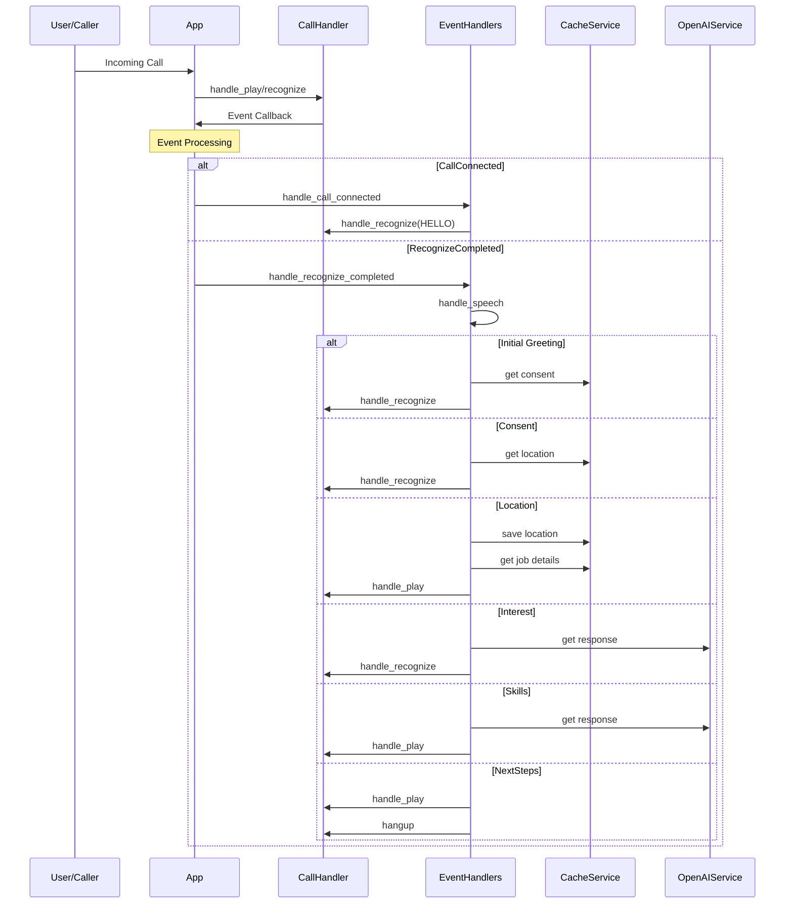

```mermaid
sequenceDiagram
    participant User as User/Caller
    participant App as App
    participant CH as CallHandler
    participant EH as EventHandlers
    participant CS as CacheService
    participant OAI as OpenAIService

    User->>App: Incoming Call
    App->>CH: handle_play/recognize
    CH->>App: Event Callback

    Note over App: Event Processing

    alt CallConnected
        App->>EH: handle_call_connected
        EH->>CH: handle_recognize(HELLO)
    else RecognizeCompleted
        App->>EH: handle_recognize_completed
        EH->>EH: handle_speech
        
        alt Initial Greeting
            EH->>CS: get consent
            EH->>CH: handle_recognize
        else Consent
            EH->>CS: get location
            EH->>CH: handle_recognize
        else Location
            EH->>CS: save location
            EH->>CS: get job details
            EH->>CH: handle_play
        else Interest
            EH->>OAI: get response
            EH->>CH: handle_recognize
        else Skills
            EH->>OAI: get response
            EH->>CH: handle_play
        else NextSteps
            EH->>CH: handle_play
            EH->>CH: hangup
        end
    end
```    