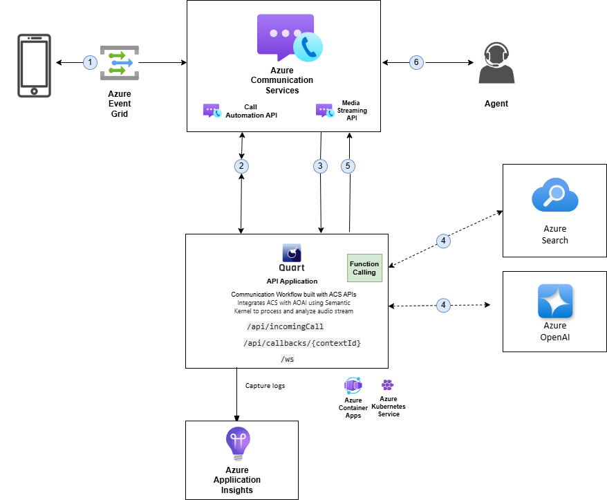

#  Call Center Voice Assistant 

## Features
- **PSTN Calling**: Users can call a phone number, and the voice assistant will interact with them using speech-to-text and text-to-speech capabilities.
- **OpenAI GPT-4o Integration**: Generates dynamic recruitment filtering chat for the potential candidate based on job description.
- **Event-Driven Architecture**: Uses **Azure EventGrid** for event-driven routing of call-related events.
- **Redis Caching**: Stores precomputed job details, competency questions, and location data to minimize repeated API calls and reduce latency.
- **Azure Services**: Leverages **Azure Maps**, **Azure Search**, and **Azure Cognitive Services** for grounding the call into relevant job description and in future in the candidate CV. 
- **Session History**: Session data and call recordings are stored in **Cosmos DB** for long-term storage.
---

## Architecture Overview
The following shows a high-level shape of the software architecture and how responsibilities are distributed across it. It also shows the major technology azure services and how the containers communicate with one another:
<br><br>
<div align="center">
  
</div>
<br>
The following Azure services and technologies are used in this project:

1. **Azure Communication Services (ACS)**: Handles incoming and (to be implemented) outgoing PSTN calls.
2. **Azure OpenAI GPT-4o**: Generates responses to user inputs using large language models.
3. **Azure Cognitive Services**: Provides speech-to-text and text-to-speech capabilities for interacting with the caller.
4. **Azure EventGrid**: Routes call events (CallConnected, RecognizeCompleted, etc.) to the **Quart API**.
5. **Azure Search**: Queries job details and other information for candidate interaction.
6. **Azure Maps**: Provides geographic location data for determining candidate proximity to job roles.
7. **Redis Cache**: Caches job details and other global variables to reduce API calls and improve performance.
8. **Azure Cosmos DB**: Stores call session data, including recordings and conversation history, for long-term storage.
---

## Prerequisites
- **Azure Subscription** with access to Azure OpenAI models.  
- **Python 3.10+** installed on your local environment.  
- [Azure Dev Tunnel](https://learn.microsoft.com/en-us/azure/developer/dev-tunnels/get-started?tabs=windows) (or alternative) for handling ACS callback URLs if testing locally.  
- [Terraform](https://learn.microsoft.com/pt-br/azure/developer/terraform/get-started-windows-bash) to deploy the IaC in the `automation` folder.
- [azd](https://learn.microsoft.com/azure/developer/azure-developer-cli/install-azd), used to deploy all Azure resources and assets used in this sample.
- **Install the Azure CLI Communication extension**
```bash
az extension add --name communication --yes
```

---

## Setup and Installation
### 1. Clone the Repository
```bash
git clone https://github.com/pablocast/gbbai-acs-azopenai-voice-integration.git
cd gbbai-acs-azopenai-voice-integration
```

### 2. Install Python Dependencies
Create a virtual environment and install the required Python libraries listed in `requirements.txt`.

#### Bash
```bash
python3.11 -m venv .venv
source venv/bin/activate
pip install -r requirements.txt
pip install api/rtclient-0.5.1-py3-none-any.whl
```

#### PowerShell
```powershell
python3.11 -m venv .venv
.venv\Scripts\Activate.ps1
pip install -r api\requirements.txt
pip install api\rtclient-0.5.3-py3-none-any.whl
```

### 3. Deploy the Terraform IaC
> [!Note]
> You need to have activated the venv and installed the requirements as the IaC automation contains python scripts that require specific libraries.

Navigate to for the details for the [Terraform automation deployment Doc](automation/README.md).

Make sure to follow the manual step of navigating inside the ACS resource and connecting it to the Cognitive Service (aka AI multiservices account) via Managed Identity. This process happens in the background when you do it from ACS. If this step is not done, the phone call will happen but it will hang up instantly.

## 4. Add the Environment Variable values to a .env file
Based on `.env.sample`, create and construct your `.env` file to allow your local app to access your Azure resource.

## 5. Index the data
This will set up an Azure Search Index to query, using the data in [data folder](./data/)

### Bash
```bash
python ./automation/setup_intvect.py
```

### Powershell
```powershell
python .\automation\setup_intvect.py
```

## 6. Running it locally

### 6.1. Enable and run a Microsoft DevTunnel
#### Running it for the first time:

#### Bash
```bash
devtunnel login
devtunnel create --allow-anonymous
devtunnel port create -p 8000
devtunnel host
```

#### Powershell
```powershell
devtunnel login
devtunnel create --allow-anonymous
devtunnel port create -p 8000
devtunnel host
```

Add the devtunnel link structured as `https://<name>.devtunnels.ms:8080` to the `.env` file as callback URI host.

#### Leveraging a previously created DevTunnel:
#### Bash
```bash
devtunnel login
devtunnel list
# copy the name of the devtunnel you want to target
devtunnel host <your devtunnel name>
```

#### Powershell
```powershell
devtunnel login
devtunnel list
# copy the name of the devtunnel you want to target
devtunnel host <your devtunnel name>
```
#### Run the app for the EventGrid Webhook to work
Then run the python app by running `python api/main.py` on your terminal and check that it runs with no issues before proceeding.

### 6.2. Register an EventGrid Webhook for the IncomingCall event that points to your devtunnel URI (`https://<name>.devtunnels.ms:8080/api/incomingCall`)
Instructions [here](https://learn.microsoft.com/en-us/azure/communication-services/concepts/call-automation/incoming-call-notification).
  - To register the event, navigate to your ACS resource in the Azure Portal (follow the Microsoft Learn Docs if you prefer to use the CLI). 
  - On the left menu bar click "Events."
  - Click on "+Event Subscription."
    - Provide a unique name for the event subscription details, for example, "IncomingCallWebhook"
    - Leave the "Event Schema" as "Event Grid Schema"
    - Provide a unique "System Topic Name"
    - For the "Event Types" select "Incoming Call"
    - For the "Endpoint Details" select "Webhook" from the drop down
      - Once "Webhook" is selected, you will need to configure the URI for the incoming call webhook, as mentioned above: `https://<name>.devtunnels.ms:8080/api/incomingCall`.
    - **Important**: before clicking on "Create" to create the event subscription, the `/api/main.py` script must be running, as well as your devtunnel. ACS sends a verification payload to the app to make sure that the communication is configured properly. The event subscription will not succeed in the portal without the script running. If you see an error, this is most likely the root cause.

### 6.3. Run the App
#### Bash
```bash
python api/main.py
```

#### Powershell
```powershell
python api\main.py
```

## 7. Running it on Azure
Once the IaC has been deployed, the web API should be ready to use.


